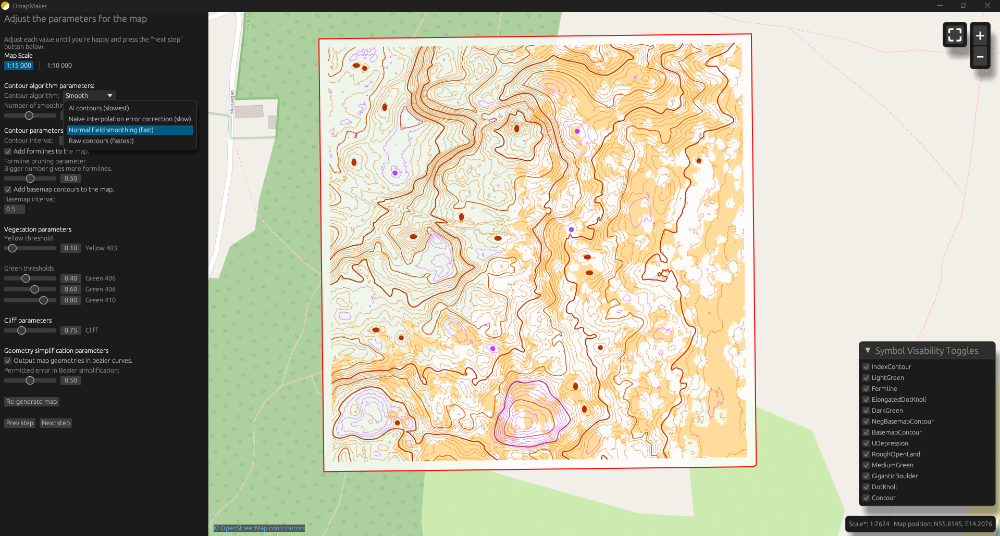

# OmapMaker
### Generate geo-refrenced and magnetic north aligned .omap files directly from lidar data

An application for generating orienteering maps (.omap file) from ground-classified lidar data.

With a GUI with parameter tuning, area filtering and lidar conversion tools.
The written omap-file is automatically georefrenced.

Overlapping lidar files not yet handled

### Implemented:
- GUI
- Raw, smoothed and interpolation-based (experimental) contours
- Basemap-contours
- Vegetation
- Writes to Omap-file
- Supports both bezier and polyline output
- Polygon filter for only mapping parts of the provided lidar files

### WIP:
- AI based contours

### Wish List:
- Water detection
- Building detection
- Vegetation boundaries
- Stream detection
- Boulder detection
- Road/path detection
- Marsh detection

### Parameter tuning in OmapMaker
Tune the map parameters on a test tile before generating the whole map

### Adding a polygon filter to lidar files
Add a polygon filter. Only lidar points inside the filter are used in map generation

