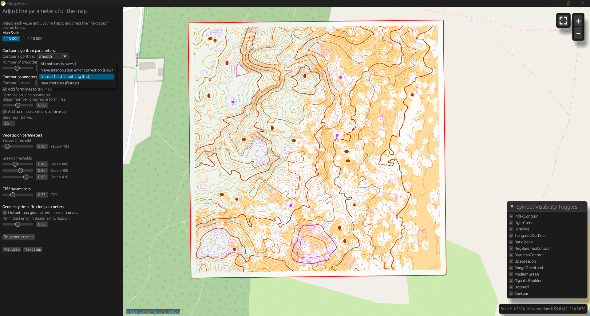

An application for generating orienteering maps (.omap file) from ground-classified lidar data.

With a GUI with parameter tuning, area filtering and lidar conversion tools.
The written omap-file is automatically georefrenced.

Overlapping lidar files not yet handled

Implemented:

    GUI

    Raw, smoothed and interpolation-based (experimental) contours

    Basemap-contours

    Vegetation

    Writes to Omap-file

    Supports both bezier and polyline output

WIP:

    AI based contours

Wish List:

    Water detection

    Building detection

    Vegetation boundaries

    Stream detection

    Boulder detection

    Road/path detection

    Marsh detection

