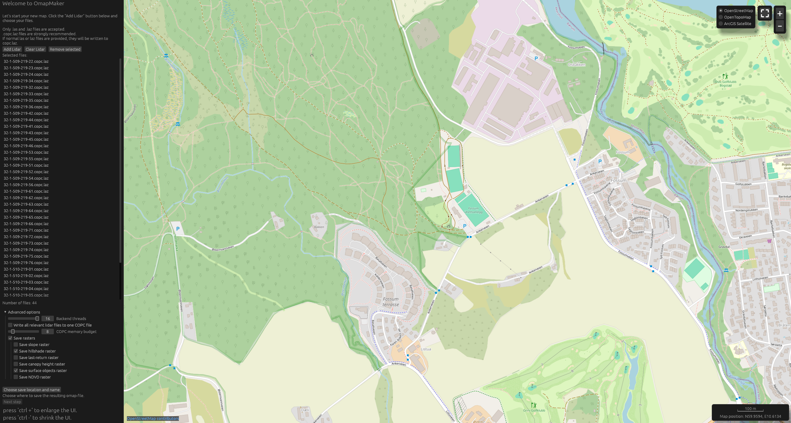
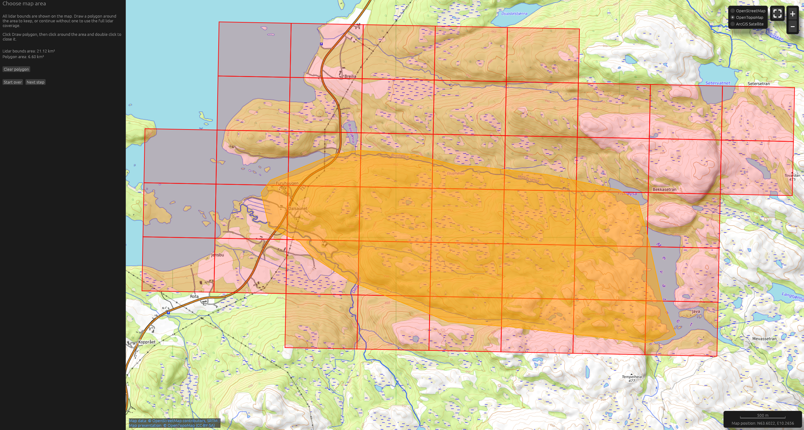
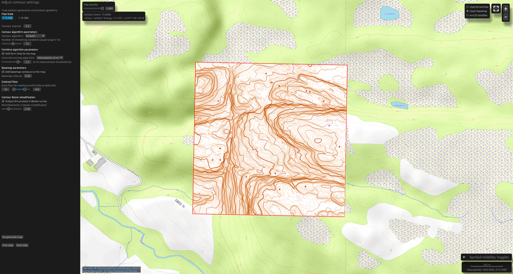
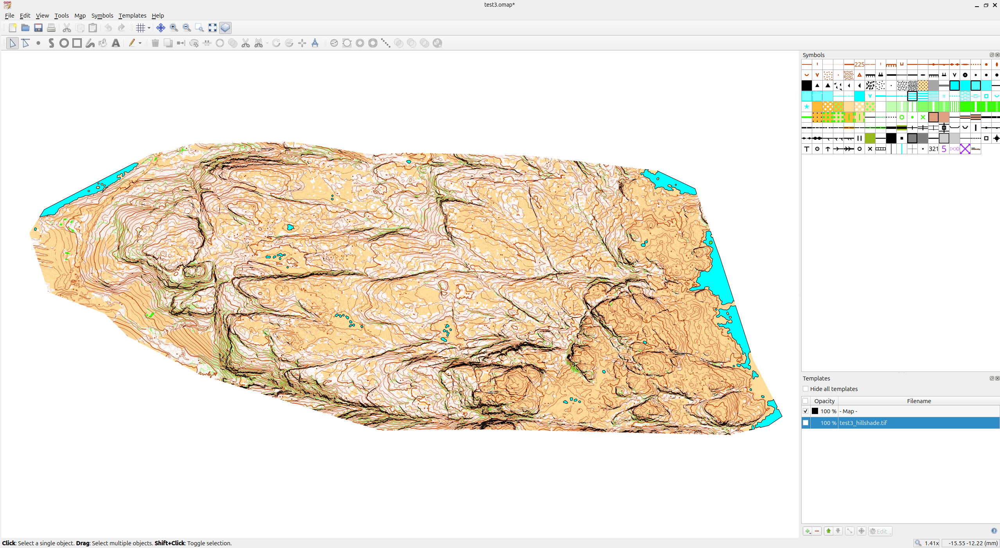
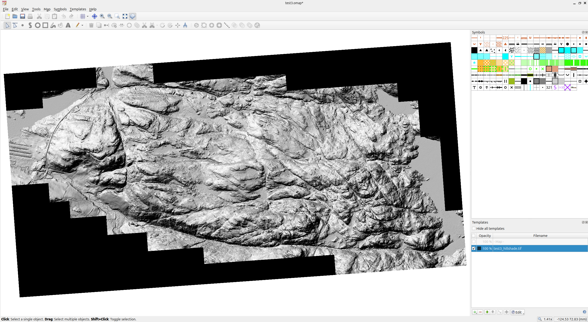

# OmapMaker
### Generate georeferenced and magnetic north aligned .omap files directly from lidar data

An application for generating orienteering maps (.omap file) from ground-classified lidar data.

With a GUI with parameter tuning, area filtering and lidar conversion tools.
The written omap-file is automatically georeferenced.

Overlapping lidar files not yet handled

### Implemented:
- GUI with live map parameter tuning
- Raw, smoothed and interpolation-based (experimental) contours
- Basemap-contours (with marked depressions)
- Vegetation
- Writes Omap-files that are 
    - georeferenced (if a CRS is detected in the lidar files or provided)
    - aligned towards the Magnetic North according to the world magnetic model based on the maps creation date and geographical position
    - correctly scaled including calculating the auxiliary scale factor based on the map center's elevation
    - in scales 1:10_000 or 1:15_000 with minimum symbol size filtering
- Supports both bezier and polyline output
- Polygon filter for only mapping parts of the provided lidar files
- .las and .laz to .copc.laz conversion
- Coordinate system assignment tool for CRS-less lidar-files (Lantmäteriet in Sweden uses EPSG:3006, but often skips writing the __mandatory__ CRS-VLR to their files)
- CRS-less files are supported if the CRS is unknown
- Non-connected lidar file detection (Useful when accidentally adding a file that should not have been added or assigning the wrong CRS to a file)
- OpenStreetMap, OpenTopoMap or ESRI satellite background map
- Experimental lidar-intensity filter
- Buffering on polygons to remove small holes and too thin areas or exaggerating small details

### WIP:
- AI contours
- Form lines
- Water detection

### Wish List:
- Building detection
- Vegetation boundaries
- Stream detection
- Boulder detection
- Road/path detection
- Marsh detection
- Lidar CRS transformation
- Overlapping Lidar handling

## Step-by-step
### Add lidar files
Add your files, select output location and optionally adjust some advanced setting.

### Add an optional polygon filter to the files
Add a polygon filter. Only the area inside the filter is processed.

### Parameter tuning
OmapMaker let's the user adjust parameters live.

#### Contour tuning

#### Openness tuning

#### Vegetation tuning

#### Cliff tuning

#### Water detection

### Writes to omap
Here is the finished map in OpenOrienteering Mapper (geo-referenced and magnetic north aligned).
The generation process is on the order of minutes, depending on point density and map size.

### Writes geo-referenced geotiffs
OmapMaker writes geotiffs for the rasters that are checked on the welcome screen

